<h1 align="center">
  
  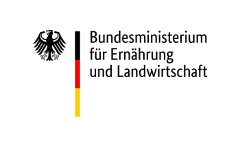
  <br/>Multi-Pose Time-Series Tomato Database
for Fine-Grained Categorization with Deep
Learning
  
  DaAnHort @ ZG JKI
  
[](https://github.com/0YJ/MPTSTD)
[](https://www.julius-kuehn.de/zg/personal/p/yujie-zhang)
</h1>

<h2 align="center">
  Part 0: Introduction

</h2>


### Overview of OPPDL

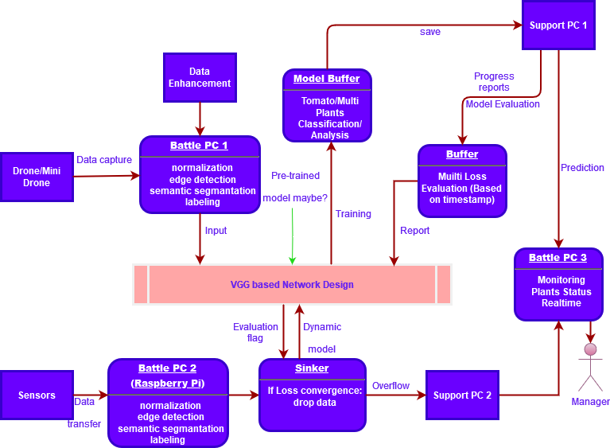

### Environment 

- Python 3.6, Tensorflow 1.5.0, Opencv 3.3.1, Keras 2.1.6
- [Optional] Since our project integrated multi machine learning models, I strongly suggest to use conda for environment management. See: [Conda](#anaconda)

<h2 align="center">
  Part 1: Data Generation 

</h2>

### Internet of Things (IoT)

We use advanced IoT technology and embedded engineering to collect and process massive scalable dataset.
We have easy to use user interface for application. 
The annotated [dataset](www.comingsoon.com) will be published in November along with the fine grained phenothyping information dataset.
<br/>

<div align="center">
  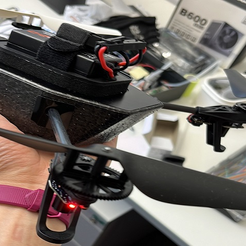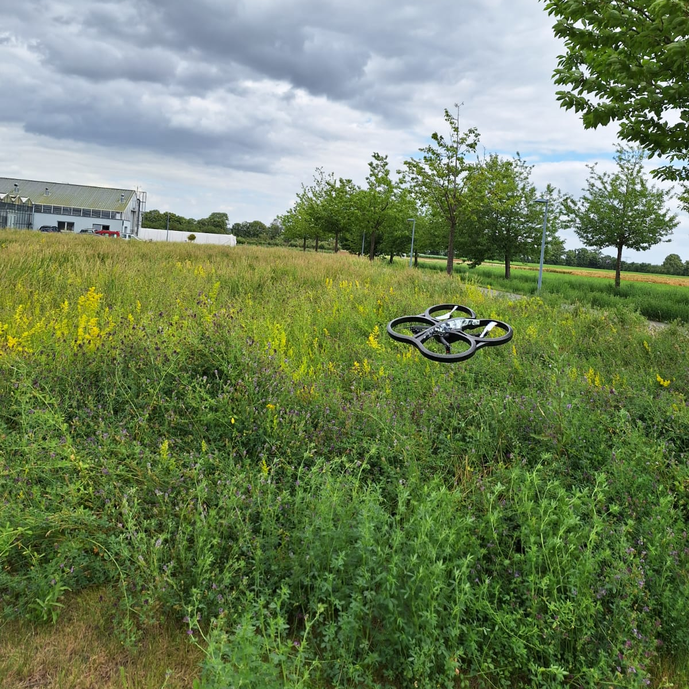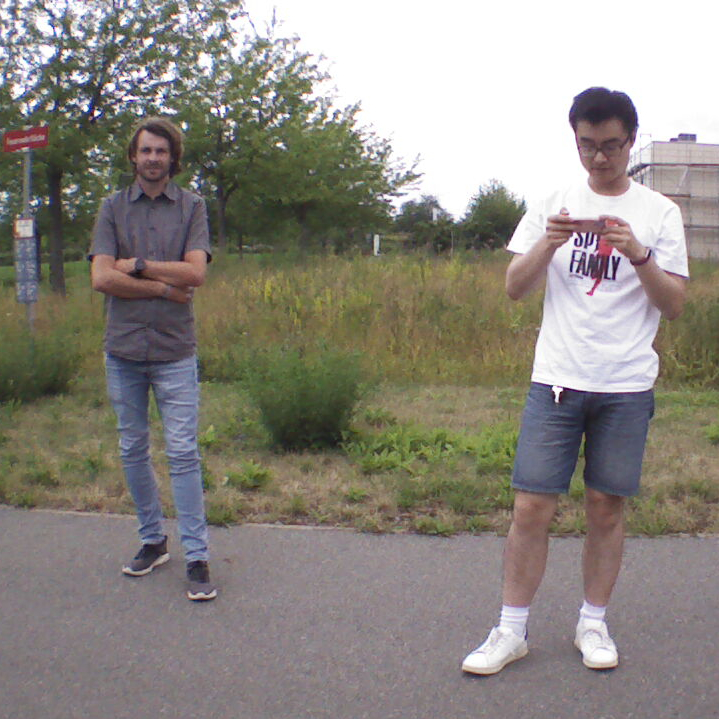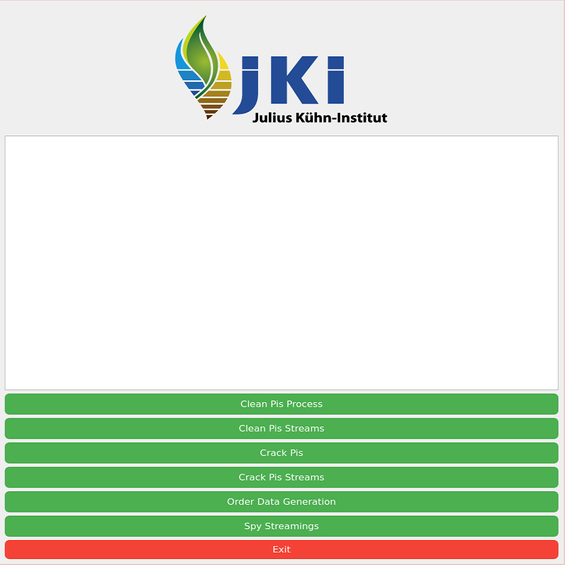
</div>

<h2 align="center">
  Part 2: Data Annotation  

</h2>

### State-of-Art Dataset  

We create and use the latest self-made annotated dataset which is calibrated from different life cycles of tomato plants. 
<br/>

<div class="box">
  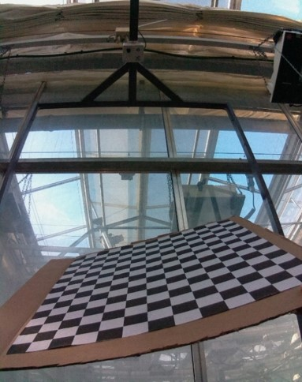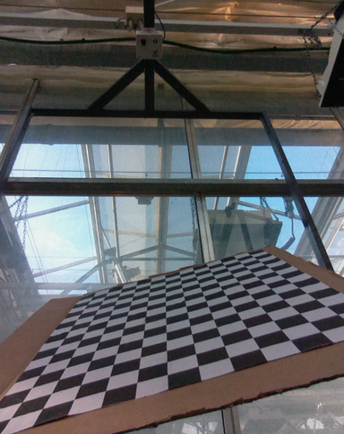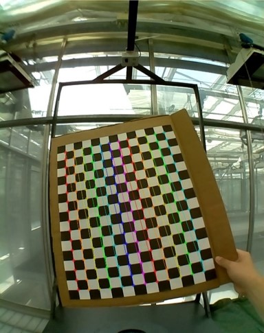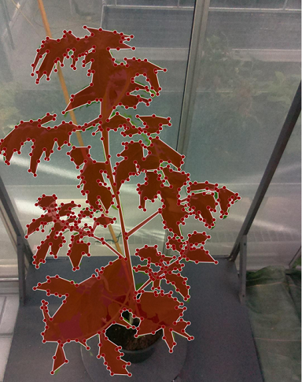
</div>


#### Installation for Data Annotation

Options for us:

- conda install 
- window executable version

#### Anaconda

Install [Anaconda](https://www.continuum.io/downloads), then run below:

```bash
# python3.6
conda create --name=py python=3.6 # creat env
conda activate py # activate env
conda install -c conda-forge labelme # install 
# or pip install labelme
# or install executable version
labelme ## run
```

  
<h2 align="center">
  Part 3: Models  

</h2>


### Data Augmentation and Machine Learning

We use augmented data and multi ML models for evaluating a standered phenotyping. 
<br/>

<div align="center">
  &nbsp;&nbsp;&nbsp;&nbsp;&nbsp;&nbsp;&nbsp;&nbsp;&nbsp;&nbsp;&nbsp;&nbsp;&nbsp;&nbsp;&nbsp;&nbsp;&nbsp;&nbsp;&nbsp;&nbsp;&nbsp;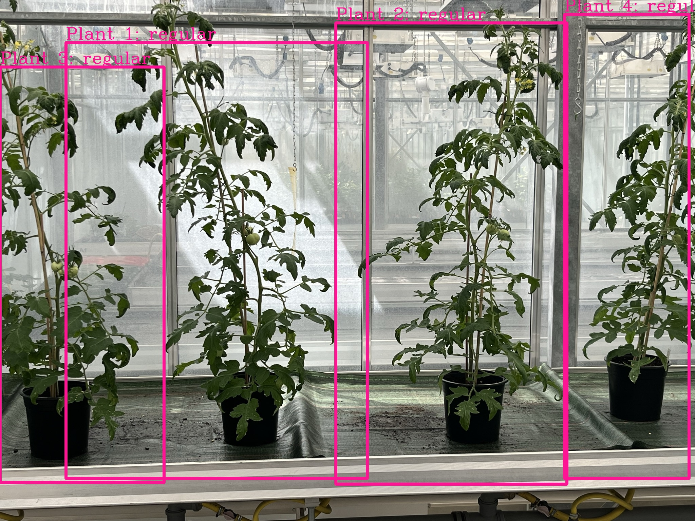
  &nbsp;&nbsp;&nbsp;&nbsp;&nbsp;&nbsp;&nbsp;&nbsp;&nbsp;&nbsp;&nbsp;&nbsp;&nbsp;&nbsp;&nbsp;&nbsp;&nbsp;&nbsp;&nbsp;&nbsp;&nbsp;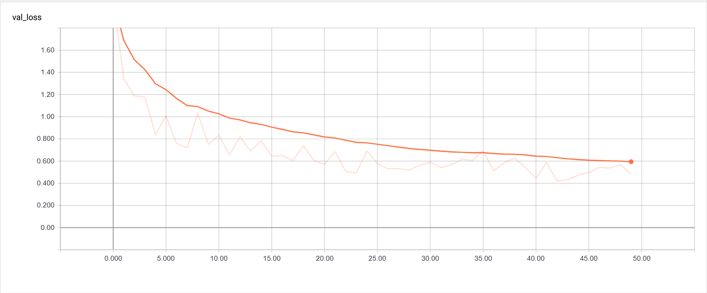
</div>


<h2 align="center">
  Part 4: Landmark and 3D Reconstruction for Nomalized Plants Phenotyping  

</h2>
This project outlines the dataset along with an exceptional approach for fine-grained phenotypic recognition of tomato plants using deep learning methods for precision agriculture (PA), offering a viable alternative for automated and efficient agricultural practices. 
Additionally, the innovative Internet of Things architecture provides efficient and scalable data collecting for phenotyping research purpose. 

<br/>

<div align="center">
  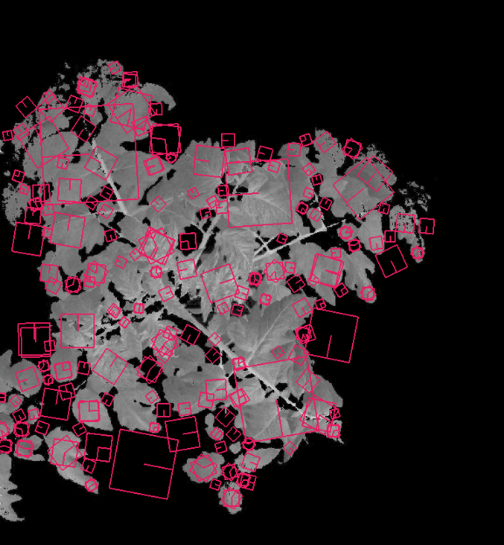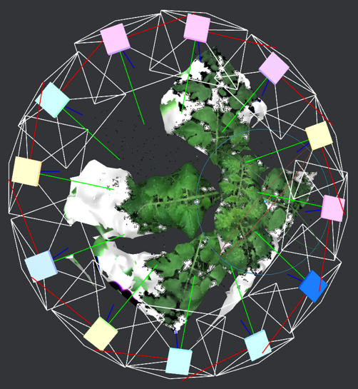
  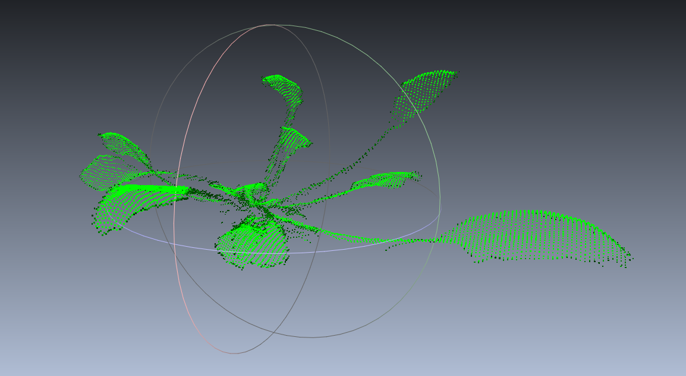
</div>

[Paper](https://github.com/0YJ/MPTSTD/blob/main/KIDA_Poster.pdf)
